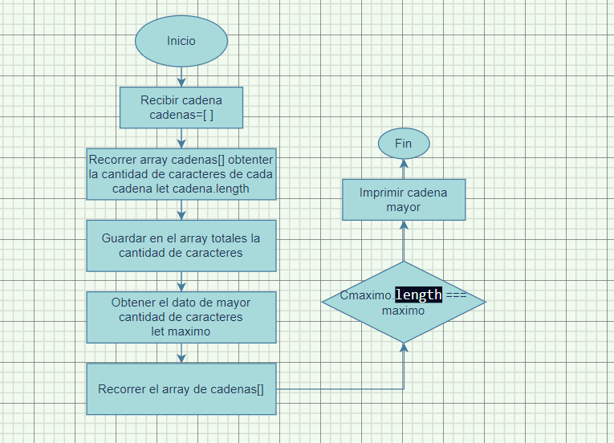

# La-frase-m-s-larga
Aplicación que toma una cadena de caracteres guarda  estas cadenas en un array, y muestra la cadena más larga guardada en este array.

# Live version 

https://jimmyanaya.github.io/La-frase-m-s-larga/cadena_mas_larga

# Logica de desarrollo

